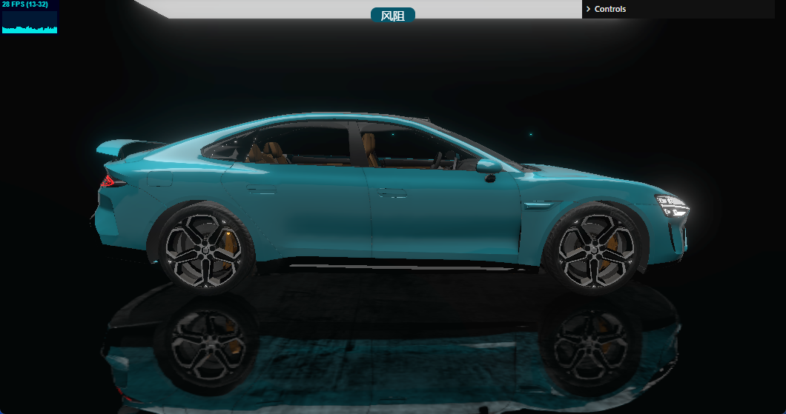
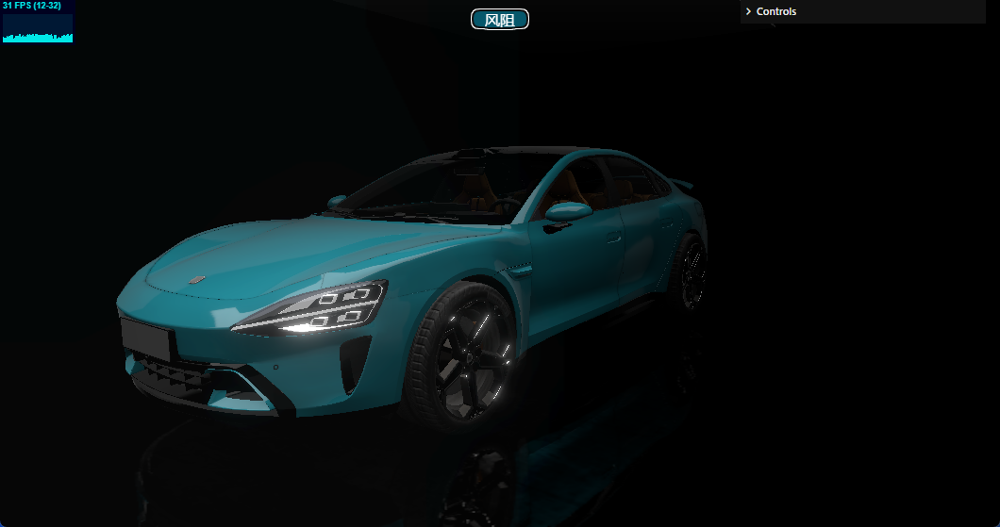
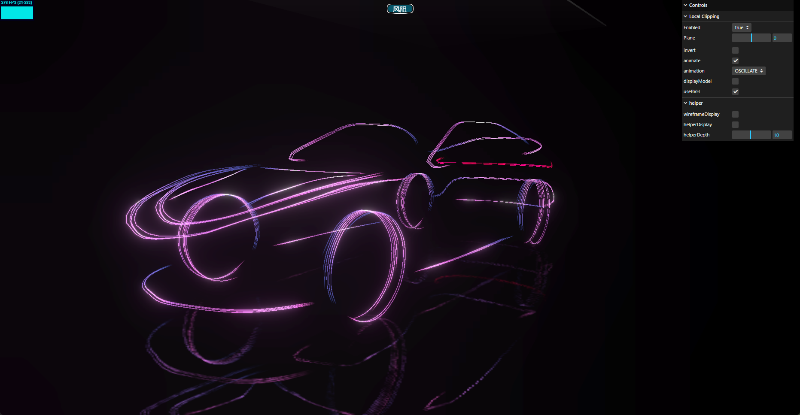

# Vue 3 + Vite
喜欢的话点个小星星，后续会把其他效果添加上
在线浏览地址https://su7-imitate.vercel.app/

> 风阻模式
- [x] 模型添加
- [x] 环境光处理
- [x] 地面反射与粗糙处理
- [x] 模式切换动画
- [x] 模型切面动画计算
- [x] 风阻模式线条与辉光
- [x] 风阻模式风的线条

> 车身检视

- [x] 尺寸
- [x] 切换动画
- [x] 高度波效果

> 智驾
- [x] 智驾场景
- [ ] 智驾车辆模型优化
